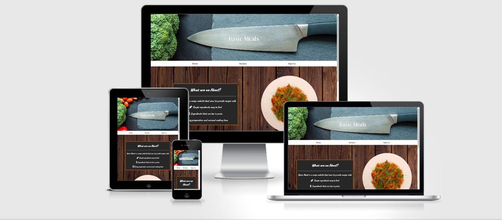
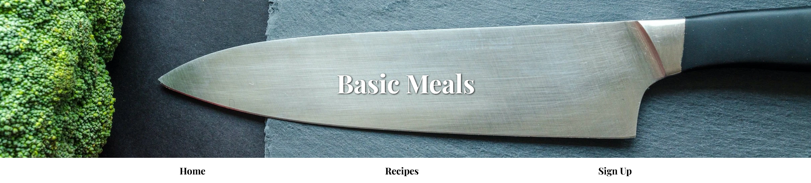
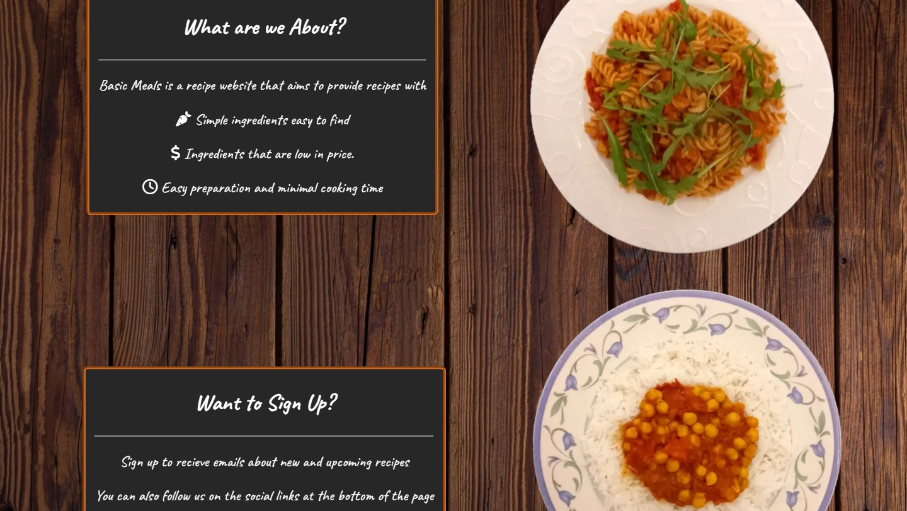
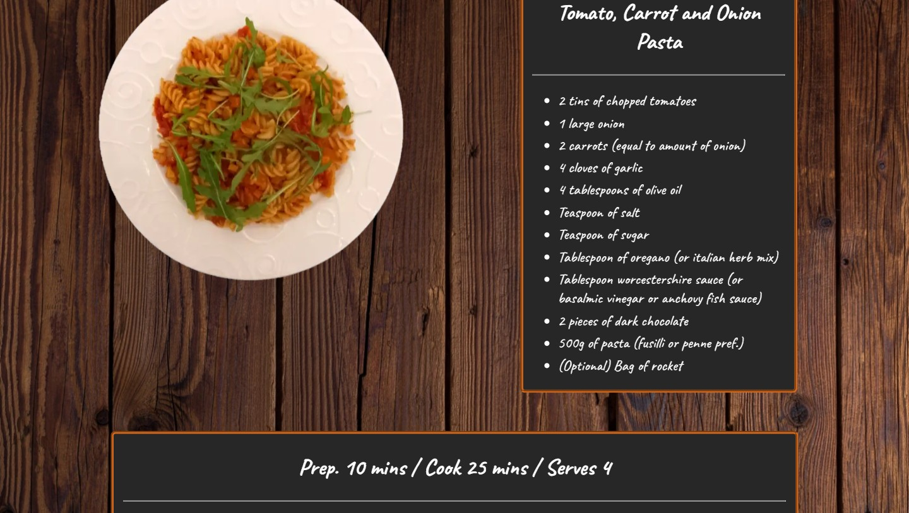
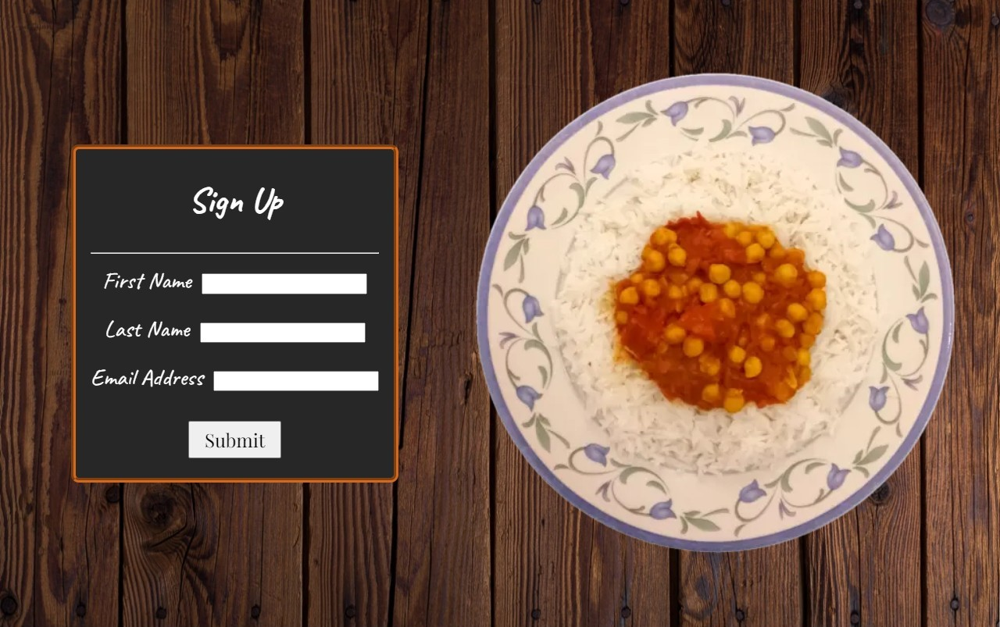
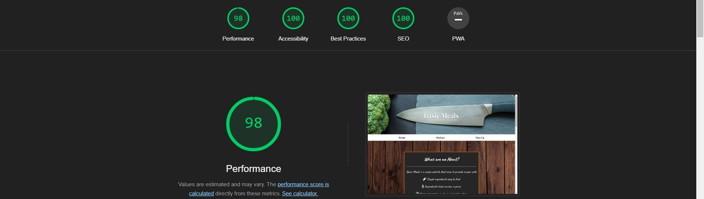

# Basic Meals

Basic Meals is a website that aims, as the site name suggests, to provide the user recipes of basic meals that include ingredients that are both affordable and accessible and recipes that are easy to cook.

Users will find the information they need in the home page 'What are we about?' board, the recipes page and the sign up page. The website is aimed at people who are cooking on a budget and want meals that are easy to make. This will most likely be parents with a family to cook for, which is why the amount of ingredients is aimed at 4 servings.

## Features

- ### Header
  - The landing page image, aswell as the heading at the center of it, is designed to be attractive to the user and also convey what the website is about, with the image being cooking related and the heading 'Basic Meals' also.

- ### Navigation
  - The navigation bar links to the three different pages on the site to help the user easily navigate.

  - The link text and background are a simple black and white for contrast and to look like a traditional menu.

- ### Home Page
  - The 'What are we about?' board gives the user the information as to what the website is about.
  
  - The 'Want to Sign Up?' board explains the reasons to sign up to receive emails, keeping the user interested and engaged in the site for the future.

  - The images on the page give a example of the meals the user can hope to cook.

- ### Recipes page
  - The recipes page has images of the recipes with the recipe name and ingredients list on a board next to it.

  - With the recipes is a board that contains information on prep/cooking time, aswell as serving amount, and a numbered instruction list.

  - The page hopes to make the ingredients and cooking steps for each meal clear and simple.

- ### Sign Up page
  - This page contains a form thats asks the user for their first name, last name and email address.

  - This data will be used to contact the user about new recipes or any other new features like newsletters or competitions.

- ### Footer
  - The footer includes icons with links to social media platforms. 

  - The links to social media aim to keep the user connected to the site via these platforms.

## Testing
- I tested the page works in different browsers: Chrome, Firefox, Edge.

- I have confirmed the website works and looks good across the standard screen sizes using developer tools.

- I have confirmed the text across the site is readable and understandable.

- I have confirmed the sign up page form works (requires text in the name fields, valid email in the email field ,the submit button works and goes to [Code Institute formdump](https://formdump.codeinstitute.net/) when the information has been entered correctly).

### Bugs

#### Solved Bugs
  - Discovered plate image didn't fit Galaxy Fold view.

  - Changed image size to fit.

### Validator Testing
  - HTML
  
    - No errors were returned when passing through the official [W3C validator](https://validator.w3.org/nu/?doc=https%3A%2F%2Fmwbark.github.io%2FBasic-Meals%2F)

    - No errors were returned when passing through the official [(jigsaw) validator](https://jigsaw.w3.org/css-validator/validator?uri=https%3A%2F%2Fmwbark.github.io%2FBasic-Meals%2F&profile=css3svg&usermedium=all&warning=1&vextwarning=&lang=en)

  - Accessibility
  
    - I confirmed the colors and fonts chosen are accessible by running it through lighthouse in devtools

  

  ### Unfixed Bugs

  no unfixed bugs

## Deployment

- The site was deployed to GitHub pages. The steps to deploy are as follows:

  - In the GitHub repository, navigate to the Settings tab

  - Click on 'Pages' on the left side menu

  - In the dropdown menu under 'Branch' select 'main'

  - Return to the repository. On the right of the screen click on 'Deployments'

  - The page link will be shown under 'github-pages'

The live link can be found here - [Basic Meals](https://mwbark.github.io/Basic-Meals/)

## Credits

### Content
- The code for the footer was taken/adapted from Code Institute's [Love Running](https://github.com/Code-Institute-Solutions/love-running-v3/tree/main) project.

- The icons were taken from [Font Awesome](https://fontawesome.com/).

### Media
- The background images for the header and main sections were taken from [Pexels](https://www.pexels.com/)

[def]: https://jigsaw.w3.org/css-validator/validator?uri=https%3A%2F%2Fmwbark.github.io%2FBasic-Meals%2F&profile=css3svg&usermedium=all&warning=1&vextwarning=&lang=en

- The plate pictures were taken by me